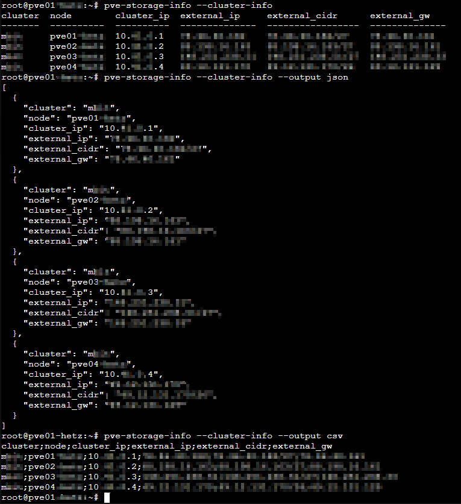
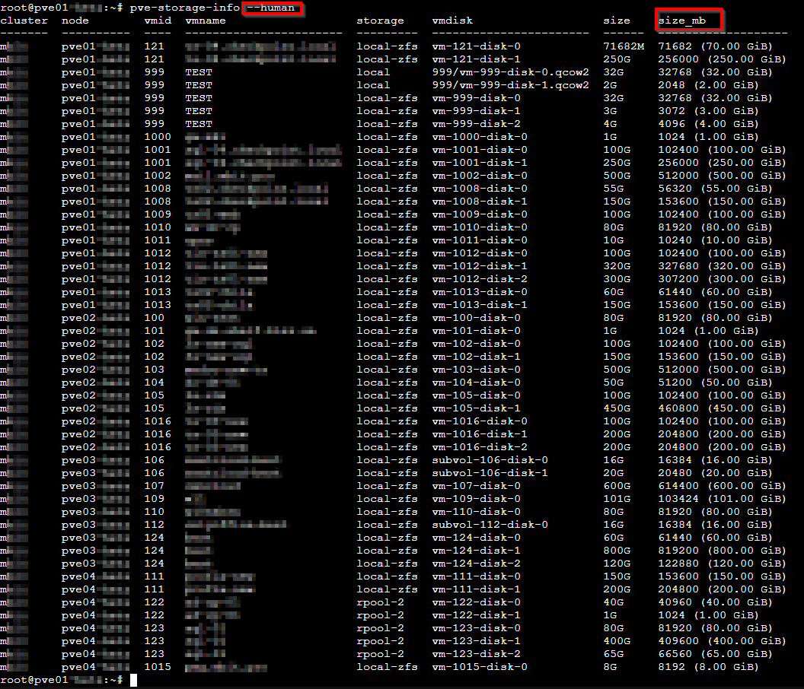
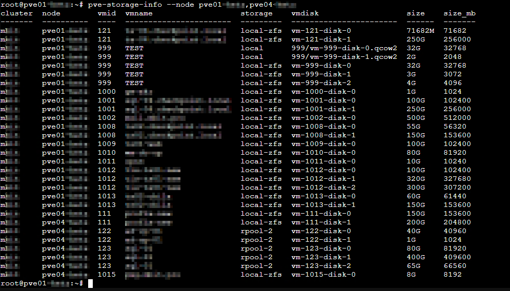
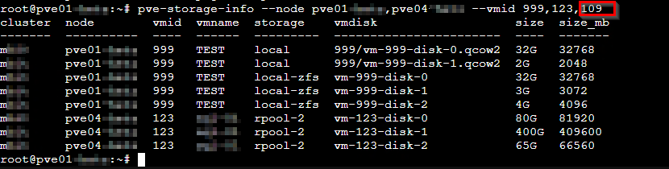
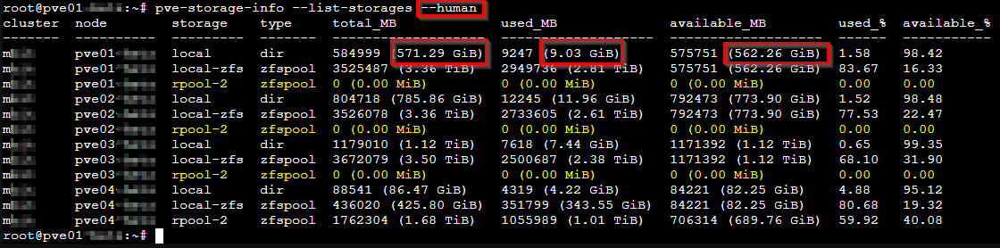
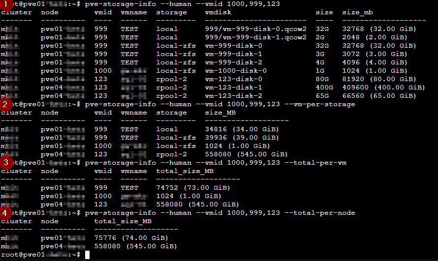

# pve-storage-info

A lightweight, ~~fast~~, parallelized (not tested) storage-inspection wrapper over some pvesh calls for **Proxmox VE**.  
It collects information about VM and container disks across a cluster, aggregates storage usage, and provides multiple output formats (table, CSV, JSON).


---

## Features

- Lists all VM/LXC disks:
  - **QEMU:** SCSI / VirtIO / IDE / SATA
  - **LXC:** rootfs, mpX mounts (NOT TESTED)
- Per-node storage usage
- Per-VM aggregated usage
- Per-storage aggregated usage
- Cluster/ring0/external IP information
- Parallel pvesh calls for high speed (NOT TESTED)
- Output formats: **table**, **csv**, **json**

---

# Installation

## Quick install (curl | sh)

```bash
curl -fsSL https://raw.githubusercontent.com/xoppepop/pve-tools/main/install.sh | sh
```

This installs:

- `/opt/pve-tools/pve-storage-info.py`
- symlink: `/usr/local/bin/pve-storage-info`

Run the tool:

```bash
pve-storage-info [OPTIONS]
```

---

# Manual installation

```bash
mkdir -p /opt/pve-tools
cd /opt/pve-tools

curl -O https://raw.githubusercontent.com/xoppepop/pve-tools/main/pve-storage-info.py
chmod +x pve-storage-info.py

ln -s /opt/pve-tools/pve-storage-info.py /usr/local/bin/pve-storage-info
```

---

# Usage

```bash
pve-storage-info --help
```

---

# Examples

### Show cluster/ring0/external IP information
```bash
pve-storage-info --cluster-info
```
```bash
pve-storage-info --output json
```
```bash
pve-storage-info --output csv
```


Outputs:

- cluster name  
- node name  
- ring0 (corosync) IP  
- external IP  
- external CIDR  
- external gateway  
---

### List all vms and their disks in cluster
```bash
pve-storage-info --human
```


### Filter nodes
```bash
pve-storage-info --node node1,node2
```


### Filter nodes and vm's
if VMID not in nodes selected - it will not be shown (109 for example - its on node pve03)
```bash
pve-storage-info --node node1,node2 --vmid id1,id2,id3
```


### Show per-node storage usage
buggy (yellow highlighted)
```bash
pve-storage-info --list-storages
```


### More examples
(1) we want see all disks for vm's 1000,999,123 across cluster
```bash
pve-storage-info --vmid 1000,999,123
```
(2) now, we want know how much disk space those vm's drives occupy on nodes storages
```bash
pve-storage-info --vmid 1000,999,123 --vm-per-storage
```
(3) how much all vm's drives occupy space
```bash
pve-storage-info --vmid 1000,999,123 --total-per-vm
```
(4) and how much those vm's occupy disk space on nodes
```bash
pve-storage-info --vmid 1000,999,123 --total-per-node
```



---

# License

BSD 2-Clause License  
© 2025 xoppepop
